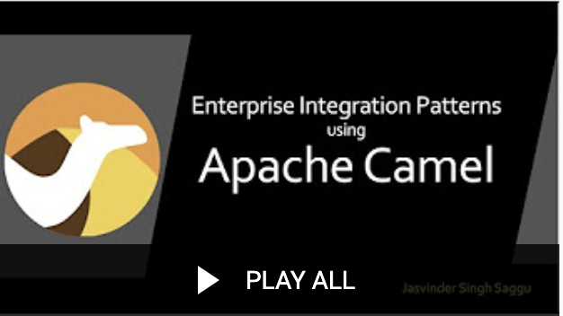

## Camel Playground


This project contains several files to test Camel components.   

Components can be enabled/disabled through `application.yml` file.

### Videos
All the tutorial videos are available on Saggu.uk YouTube channel.

[](https://www.youtube.com/playlist?list=PLYwGWvgqiQCnRUzcdP1h6l-d9fRjP-Ed7)

## Metrics

Camel Metrics are exposed using Spring Actuator, Prometheus, Grafana

#### To start all-in-one to test Metrics
```shell
mvn clean install -DskipTests
docker build -t saggu/camel .

cd src/main/resources/docker

docker-compose -f metrics-docker-compose.yml up -d
```

### To Access
|Application|URL|
|---|---|
|Saggu Camel|http://localhost:8080/actuator/prometheus|
|Prometheus|http://localhost:9090/|
|Grafana (admin/admin)|http://localhost:3000/|
