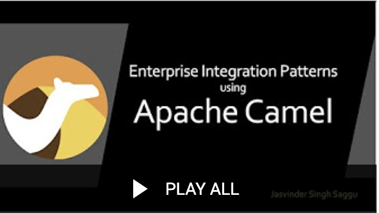

# Camel Playground


A single Spring Boot application that bundles ~40 self-contained Apache Camel routes, each
demonstrating one integration pattern or component: EIPs (splitter, aggregator, content-based
router, wire tap, multicast, composed message processor), error handling, RabbitMQ, JMS/ActiveMQ,
Kafka, NATS, the SAGA pattern, a Resilience4j circuit breaker, REST DSL, metrics (Prometheus /
Grafana) and OpenTelemetry tracing.

Every route is disabled by default and switched on individually — see
[Enabling routes](#enabling-routes).

The accompanying tutorial videos are on the
[Saggu.uk YouTube channel](https://www.youtube.com/playlist?list=PLYwGWvgqiQCnRUzcdP1h6l-d9fRjP-Ed7).

[](https://www.youtube.com/playlist?list=PLYwGWvgqiQCnRUzcdP1h6l-d9fRjP-Ed7)

---

## Tech stack

| | Version |
|---|---|
| Java | 21 |
| Spring Boot | 4.1.x |
| Apache Camel | 4.22.x (LTS) |
| Build | Maven 3.9+ (no wrapper — use a locally installed `mvn`) |
| Tests | JUnit 6, `camel-test-junit6`, Testcontainers 2.x |

---

## Prerequisites

- **JDK 21** (`java -version` should report 21). On macOS: `brew install openjdk@21`.
- **Maven 3.9+** (`brew install maven`).
- **Docker** — only needed to run the `WeatherRouteTestcontainersTest` integration test and the
  `docker compose` stacks below. The rest of the build and test suite needs nothing external.

---

## Build

```
mvn clean package
```

This compiles, runs Spotless formatting checks (Google Java Format, AOSP style — run
`mvn spotless:apply` to fix violations), runs the test suite, and produces
`target/camel-tutorial.jar`.

Skip the tests with `mvn clean package -DskipTests`.

---

## Run the application

The app listens on **http://localhost:8080**.

```
# option A - from the jar
java -jar target/camel-tutorial.jar

# option B - via the Maven plugin
mvn spring-boot:run
```

The default `src/main/resources/application.yml` enables the RabbitMQ routes
(`jss.camel.rabbitmq.enabled: true`), so out of the box the app expects a broker on
`localhost:5671` and route startup fails without one. Either start RabbitMQ first
(see [RabbitMQ](#rabbitmq)) or run with the RabbitMQ routes turned off:

```
java -jar target/camel-tutorial.jar --jss.camel.rabbitmq.enabled=false
```

Useful endpoints once it is up:

| Endpoint | Purpose |
|---|---|
| `GET /hello?sleepTimeMills=1000` | Spring MVC ping endpoint that sleeps a random 0-N ms |
| `GET /services/...` | Camel `camel-servlet` REST DSL routes (context path `/services/*`) |
| `GET /actuator/health` | Liveness / readiness |
| `GET /actuator/prometheus` | Prometheus metrics |
| `GET /actuator/info` | Build info |

---

## Enabling routes

Nothing runs by default except the RabbitMQ routes. Each route `@Component` (and most
`@Configuration` classes) is gated by a `jss.camel.<feature>.enabled` flag, listed under `jss.camel`
in `src/main/resources/application.yml`.

Turn a route on in one of three ways:

```
# 1. edit application.yml            jss.camel.hello.enabled: true
# 2. JVM system property             java -jar target/camel-tutorial.jar -Djss.camel.hello.enabled=true
# 3. Spring command-line argument    java -jar target/camel-tutorial.jar --jss.camel.hello.enabled=true
```

Flags currently wired up (non-exhaustive): `hello`, `seda`, `file`, `rabbitmq`,
`rabbitmq-throttler`, `rabbitmq-stress-tester`, `wiretap`, `rest-dsl`, `rest-java-dsl`,
`rest-metrics`, `kafka`, `jms`, `saga`, `circuit-breaker`, `nats`. To find the flag for a given
route, look at the `@ConditionalOnProperty` annotation on its class.

Enabling `jms` also requires adding `spring-boot-starter-activemq` and un-commenting the
`spring.autoconfigure.exclude` entry in `application.yml`.

---

## Tests

```
mvn test                                          # full suite
mvn test -Dtest=ChoiceRouteTest                   # one class
mvn test -Dtest=ChoiceRouteTest#givenGadgetOrderRequest_route_WillProcessGadgetOrder
mvn test -Dtest='!WeatherRouteTestcontainersTest' # skip the Docker-dependent test
```

- Route unit tests extend `org.apache.camel.test.junit6.CamelTestSupport`; Spring-context tests
  use `@CamelSpringBootTest` + `@SpringBootTest`.
- `WeatherRouteTestcontainersTest` starts RabbitMQ with Testcontainers and is **skipped
  automatically when Docker is not available**.
- Surefire runs with `reuseForks=false` (a fresh JVM per test class) to isolate the two test
  styles from each other.

---

## RabbitMQ

### Plain broker (no TLS)

```
docker compose -f src/main/resources/docker/rabbit-docker-compose.yml up -d
```

AMQP on `5672`, management UI on http://localhost:15672 (`guest` / `guest`). Then run the app
with `--spring.rabbitmq.port=5672 --spring.rabbitmq.ssl.enabled=false`.

### TLS broker

`src/main/resources/docker/docker-compose.yml` runs a TLS-enabled RabbitMQ on `5671` using
`src/main/resources/docker/rabbitmq/rabbitmq.conf` and certificates mounted from
`src/main/resources/docker/rabbitmq/certs/`.

The certificate files are **git-ignored** (`*.p12 *.crt *.key *.csr *.srl`) - generate them once:

```
mkdir -p src/main/resources/docker/rabbitmq/certs
cd src/main/resources/docker/rabbitmq/certs

# CA key and certificate
openssl genrsa -out ca.key 2048
openssl req -x509 -new -nodes -key ca.key -sha256 -days 1024 -out ca.crt -subj "/CN=MyCA"

# Server key and certificate signing request
openssl genrsa -out server.key 2048
openssl req -new -key server.key -out server.csr -subj "/CN=localhost"

# Sign the server cert with the CA
openssl x509 -req -in server.csr -CA ca.crt -CAkey ca.key -CAcreateserial \
  -out server.crt -days 365 -sha256

# Client trust store used by the application
keytool -import -alias rabbitmq -file ca.crt -keystore keystore.p12 \
  -storetype PKCS12 -storepass changeit -noprompt
```

The application picks the trust store up via these properties (already present, commented, in
`application.yml`):

```
spring:
  rabbitmq:
    port: 5671
    ssl:
      enabled: true
      trust-store: classpath:docker/rabbitmq/certs/keystore.p12
      trust-store-password: changeit
      trust-store-type: PKCS12
```

Start the TLS broker with
`docker compose -f src/main/resources/docker/docker-compose.yml up -d rabbitmq`.

---

## Metrics (Prometheus + Grafana)

Camel and Spring metrics are exposed at `/actuator/prometheus`.

```
mvn clean install -DskipTests
docker build -t saggu/camel .
docker compose -f src/main/resources/docker/metrics-docker-compose.yml up -d
```

| Application | URL |
|---|---|
| App metrics | http://localhost:8080/actuator/prometheus |
| Prometheus | http://localhost:9090/ |
| Grafana (`admin` / `admin`) | http://localhost:3000/ |

A starter dashboard is in `src/main/resources/grafana/Camel-Dashboard.json`.

---

## OpenTelemetry tracing

Camel tracing uses `camel-opentelemetry2` (`@CamelOpenTelemetry2` on `CamelApplication`).

```
# 1. start an OTLP collector + Jaeger UI
docker compose -f src/main/resources/docker/docker-compose.yml up -d otel

# 2. run the app with the OpenTelemetry Java agent
#    download: https://github.com/open-telemetry/opentelemetry-java-instrumentation/releases
java -javaagent:/path/to/opentelemetry-javaagent.jar \
     -Dotel.traces.exporter=otlp \
     -Dotel.exporter.otlp.endpoint=http://localhost:4317 \
     -jar target/camel-tutorial.jar
```

Traces: http://localhost:16686/ (Jaeger UI).

---

## Other local stacks

`src/main/resources/docker/docker-compose.yml` also defines services for Kafka, NATS, ActiveMQ,
Postgres and Tomcat. Start them individually, e.g.:

```
docker compose -f src/main/resources/docker/docker-compose.yml up -d nats
docker compose -f src/main/resources/docker/kafka-docker-compose.yml up -d
```

---

## Project layout

| Path | Contents |
|---|---|
| `src/main/java/com/jss/CamelApplication.java` | Spring Boot entry point (also WAR-deployable) |
| `src/main/java/com/jss/routes/**` | one package/class per Camel pattern; `RouteBuilder` is the entry point |
| `src/main/java/com/jss/config/`, `.../routes/*/*Configuration.java` | Camel/Spring beans, conditionally loaded |
| `src/main/java/com/jss/dto/` | Jackson / JAXB payload types |
| `src/main/java/com/jss/health/` | custom Actuator health indicators (demo, disabled) |
| `src/main/resources/application.yml` | feature flags, thread pools, RabbitMQ/TLS, actuator, logging |
| `src/main/resources/camel-routes/routes.xml` | XML-DSL routes (empty placeholder) |
| `src/main/resources/docker/` | `docker compose` stacks (metrics, kafka, rabbit, otel, ...) |
| `src/main/resources/grafana/` | Grafana dashboard JSON |

See [CLAUDE.md](CLAUDE.md) for a deeper architecture overview.
